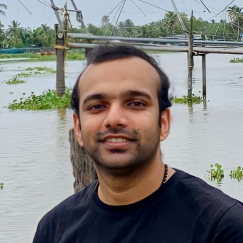

<h1 style="border-bottom: none; margin-bottom: 0.1em; padding-bottom: 0;">LEO VARGHESE</h1>
<h3 style="margin-top: 0; font-weight: 500; color: #555;">Senior Full Stack Developer & Cloud Architect</h3>

  📍 Kochi, India &nbsp;|&nbsp; 
  ✉️ <a href="mailto:leogopuran@gmail.com" style="text-decoration: none;">leogopuran@gmail.com</a> 
  🔗 <a href="https://www.linkedin.com/in/leovarghese/" style="text-decoration: none;">LinkedIn</a> &nbsp;|&nbsp; 
  💻 <a href="https://github.com/leogopuran" style="text-decoration: none;">GitHub</a> &nbsp;|&nbsp; 
  🌐 <a href="https://leogopuran.github.io/" style="text-decoration: none;">Interactive Portfolio</a>

---

## PROFESSIONAL SUMMARY
Senior Full Stack Developer and AWS Certified Solutions Architect with over 9 years of experience engineering scalable, cloud-native applications. Currently driving performance engineering for the Instana observability platform at IBM India Software Labs. 

Demonstrates a proven ability to combine deep technical expertise in API-first and event-driven microservices (Java, Python, REST, Kafka) with a strategic business perspective (MBA in Operations) to deliver high-throughput, fault-tolerant solutions. Deeply invested in advancing software engineering practices by integrating Generative AI, Small Language Models (SLMs), and autonomous coding agents to accelerate enterprise development lifecycles.

---

## CORE COMPETENCIES
* **Backend & Architecture:** Java, Python, SpringBoot, Microservices, Event-Driven Architecture (EDA)
* **Cloud & DevOps:** Amazon Web Services (AWS), Microsoft Azure, Kubernetes, Containerization, Jenkins, Concourse CI/CD, Git, Bitbucket
* **Data & Streaming:** Apache Kafka, ClickHouse, Elasticsearch, ActiveMQ, AWS SQS
* **Frontend & UI/UX:** Angular, JavaScript, HTML5, CSS3, Bootstrap
* **Performance & Operations:** Performance Benchmarking, System Troubleshooting, SDLC Management, Technical Mentorship
* **Emerging Tech & AI:** AI Tooling Integration, Small Language Models (SLMs), Model Context Protocol (MCP), Vibe Coding, IBM BOB, Google Antigravity

---

## PROFESSIONAL EXPERIENCE

### **IBM India Software Labs** | Kochi, India
**Senior Full Stack Developer** | *August 2022 – Present*
* Drive core development and architecture for the **Instana** observability tool, with a specialized focus on Performance Engineering.
* Lead architectural design reviews, conduct rigorous performance benchmarking, and troubleshoot complex bottlenecks across highly distributed enterprise workloads.
* Mentor cross-functional engineering teams in Java, Python, and Kubernetes best practices, acting as the "go-to" technical authority to resolve architectural doubts.
* Actively explore and integrate modern AI tooling and paradigms into the development lifecycle to automate code reviews, generate test cases, and enhance product intelligence.

### **Tata Consultancy Services (TCS)** | Kochi, India
**IT Analyst** | *March 2019 – August 2022*
* Spearheaded massive on-premise to cloud migrations (AWS and Azure) for premier global clients, including **Belgium Post (Bpost)** and **Bayer**.
* Navigated complex, provider-specific cloud limitations to design fault-tolerant, horizontally scalable architectures.
* Architected and deployed highly optimized, event-driven microservice networks utilizing ActiveMQ and AWS SQS.
* Developed responsive, user-centric frontend interfaces and enterprise dashboards using Angular, applying strong UI/UX principles.

### **IBS Software** | Kochi, India
**Senior Software Engineer** | *September 2016 – February 2019*
* Engineered high-availability microservices and customer booking web tools within the high-stakes airline domain.
* Delivered critical travel aggregation features for major clients like **Expedia**.
* Aligned rigorous technical deliverables with business outcomes and revenue goals by mastering domain-specific travel and airline logic.

---

## EDUCATION

**Master of Business Administration (MBA) in Operations Management**
*Indira Gandhi National Open University (IGNOU)* | *2020 – 2022*
* Leveraged operations principles to master SDLC planning, strategic delegation, and optimal project delivery methodologies.

**Bachelor of Technology (BTech) in Computer Science**
*Adi Shankara Institute of Engineering and Technology* | *2012 – 2016*

---

## CERTIFICATIONS & ACHIEVEMENTS
* ☁️ **AWS Certified Solutions Architect** (Amazon Web Services)
* 🐳 **IBM Certified Container Practitioner** (IBM)
* 🚀 **Kerala Startup Mission Certification**
